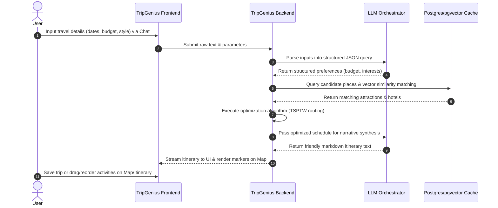

# Product Requirements Document (PRD)

## Project: TripGenius AI (AI Travel Assistant)
**Date:** June 4, 2026  
**Status:** Under Review  
**Target Output File:** `docs/PRD-AITravelAssistant.md`

---

## 1. Product Overview & Problem Statement

### Overview
TripGenius AI is a production-ready AI-powered travel planning web platform. It helps users eliminate travel planning friction by automatically organizing highly optimized, constraint-aware itineraries and hotel recommendations in seconds. Unlike traditional static travel guides or hallucination-prone text chatbots, TripGenius AI uses a hybrid approach: combining natural language AI logic with mathematical constraint-solving algorithms to generate schedules that are geographically logical, temporally realistic, and highly personalized.

### Problem Statement
Planning travel manually involves aggregating and cross-referencing information across multiple platforms (e.g., Google Maps for locations, TripAdvisor for ratings, Booking.com for prices, and individual venue websites for opening hours). Coordinating these factors with budget constraints and transportation schedules requires significant time and effort. Existing AI solutions often output itineraries that include closed venues, unrealistic transit times, and fabricated hotels, leading to user distrust.

---

## 2. Target User Personas

### Persona 1: Sarah, "The Time-Starved Planner"
* **Demographics:** 32, Marketing Director, travels with her partner.
* **Goals:** Wants to experience the best of a city in a 3-day weekend without spending 10+ hours researching blogs and maps beforehand.
* **Frustrations:** Overwhelmed by choice on Yelp/Google. Hates rigid group tour itineraries but lacks the time to map out independent schedules.
* **Core Need:** A personalized, print-or-go itinerary that takes care of the routing logistics for her.

### Persona 2: Marcus, "The Optimization Enthusiast"
* **Demographics:** 27, Software Engineer, solo traveler.
* **Goals:** Maximize his travel hours. Wants to see historical landmarks, local coffee spots, and dinner venues in a seamless sequence.
* **Frustrations:** Planning routes that double back on themselves. Getting to a museum only to find it closed on Mondays.
* **Core Need:** Geographically optimal routes with accurate travel durations and strict adherence to venue opening hours.

---

## 3. User Journey



### Detailed User Flow
1. **Onboarding:** User signs up, logs in, and completes a brief 3-click interest setup (selecting budget level, travel pace, and interests like food, art, nature).
2. **Trip Creation:** User inputs destination, dates, budget tier, and writes a prompt (e.g., "I'm visiting Tokyo. I love historic temples, sushi, and want a relaxed pace").
3. **Draft Generation:** The system processes the input and renders a dual-pane layout: a structured daily schedule on the left and an interactive map with pins and routes on the right.
4. **Customization & Iteration:** The user drags cards to change times, clicks "regenerate" on specific items for alternative options, or updates their prompt to adjust the theme.
5. **Saving/Exporting:** The user saves the trip to their profile dashboard for future reference.

---

## 4. MVP Scope & Feature Breakdown

### 1. User Account & Profiles
* **Sign-up & Login:** Email/password and Google OAuth signup.
* **User Profile:** Manage travel preferences (budget tier, travel pace, standard diet restrictions) and edit account details.
* **Dashboard:** A unified page showing "My Saved Trips" (active, upcoming, and past).

### 2. AI Travel Planner
* **Input Interface:** A conversational text input field complemented by structured dropdown selectors for destination search (with autocomplete), dates, budget tier (low, medium, high), and travel pace.
* **Itinerary Generator:** Outputs a daily schedule dividing the day into Morning, Afternoon, and Evening slots. Each item includes estimated start/end times, description, price estimate, and address.

### 3. Itinerary Management
* **Save/Load:** One-click save to profile database.
* **Manual Edits:** Draggable itinerary cards to swap activities or change timing.
* **Regeneration:** A "Swap Attraction" button on every card that fetches the next-ranked attraction in the candidate pool without breaking the rest of the schedule.

### 4. Hotel Recommendations
* **Curation Panel:** Recommends the top 3 hotels matching the user's budget tier, rating threshold (>4.0), and average distance to the generated itinerary's geographic center of gravity.
* **Metadata Cards:** Displays rating, estimated price per night, amenities, and location indicators.

### 5. Map Experience
* **Interactive Map:** Displays Google Maps or Mapbox canvas.
* **Markers:** Color-coded markers (blue for attractions, green for hotels, orange for restaurants).
* **Routes:** Polyline path routing linking sequential points of the daily itinerary.

---

## 5. User Stories & Acceptance Criteria

### User Story 1: Account Management
> **As a** traveler,  
> **I want to** create an account and save my preferences,  
> **So that** I don't have to re-enter my interests and budgets every time I plan a trip.

* **Acceptance Criteria:**
  * Must support email/password sign-up with email verification and Google single sign-on (OAuth).
  * System must save profile options (budget tier: Budget/Mid-range/Splurge; pace: Slow/Moderate/Fast; interest vectors).
  * Users must be redirected to their dashboard upon successful login.

### User Story 2: Itinerary Generation
> **As a** time-starved traveler,  
> **I want** the system to generate a geographically optimized schedule,  
> **So that** I do not waste hours during my trip traveling between far-apart places.

* **Acceptance Criteria:**
  * Itinerary items must not overlap in time.
  * The system must check and enforce venue opening hours retrieved from the Place API.
  * Travel time between sequential events must be estimated and added as a spacer card in the UI (e.g., "15 min walk" or "20 min transit").
  * Total daily attractions must not exceed the travel pace configuration (Slow: 2-3 POIs/day; Moderate: 3-4 POIs/day; Fast: 5+ POIs/day).

### User Story 3: Hotel Recommendations
> **As a** budget-conscious traveler,  
> **I want to** see hotel recommendations near my planned activities,  
> **So that** I don't book a hotel on the opposite side of the city.

* **Acceptance Criteria:**
  * Recommends exactly 3 options.
  * Recommended hotels must fall within the user's specified budget tier.
  * The average distance from the recommended hotels to the daily activities must be less than 5 kilometers (or optimized for transit accessibility).

### User Story 4: Drag-and-Drop Editing
> **As a** flexible traveler,  
> **I want to** drag and drop activities to reorder my day,  
> **So that** I can easily adjust my schedule manually.

* **Acceptance Criteria:**
  * Re-ordering cards updates the UI dynamically.
  * Swapping elements triggers a background calculation that updates transit times between the new sequences.
  * If a manual swap causes a venue conflict (e.g., dragging a museum to a time slot when it is closed), a warning indicator must appear on the card.

---

## 6. Data Requirements

### 1. Unified Location Cache Schema (`places`)
To optimize API costs, we must store location metadata in our primary database:
* `place_id`: String (Primary Key, matches Google/Amadeus Place ID).
* `name`: String.
* `category`: Enum (attraction, restaurant, cafe, shop).
* `coordinates`: Point (Latitude/Longitude).
* `rating`: Float.
* `price_level`: Integer (1 to 4).
* `opening_hours`: JSONB (storing open/close intervals per day of week).
* `address`: String.
* `embedding`: Vector(1536) (pgvector representing attraction summary for semantic search).
* `last_updated`: Timestamp (TTL management - update cache if > 14 days old).

### 2. Live API Integrations
* **Amadeus Hotel Search API:** Fetches real-time price rates, ratings, and availability based on selected city codes and travel dates.
* **Google Places API (Autocomplete & Details):** Used for user destination search and pulling detailed opening hours, addresses, and images for candidate places.

---

## 7. AI & Recommendation Engine Requirements

### AI Preference Parsing Prompt Schema
* System must translate user text prompts into a structured JSON schema:
```json
{
  "destination": "Tokyo",
  "dates": { "start": "2026-07-10", "end": "2026-07-13" },
  "budget_tier": "Mid-range",
  "travel_pace": "Moderate",
  "preferred_categories": ["museums", "historical_sites", "sushi_restaurants"],
  "avoid_categories": ["theme_parks"]
}
```

### Recommendation Funnel Logic
1. **Candidate Match:** Filter database for `places` where location is within `destination` boundary and interests match user preference vectors (using cosine similarity `pgvector` index).
2. **Rule Pruning:** Exclude any places that are permanently closed or exceed budget levels.
3. **Solver Input:** Pass the top 15-20 sorted candidates to the TSPTW (Traveling Salesperson Problem with Time Windows) solver.
4. **LLM Narrative Builder:** Provide the output itinerary to the LLM. Instruct it to append localized context-aware summaries (e.g., "Take the Ginza line to Senso-ji temple to beat the crowds").

---

## 8. Out-of-Scope Features (Saved for V2)
* **Direct Booking Checkout:** Booking buttons will link directly to external booking platforms (Agoda/Booking.com affiliate links) rather than processing payments natively.
* **Flights Search & Tracking:** Air travel planning, flight bookings, and delay updates are deferred.
* **Social Collaboration:** Real-time editing with multiple users on the same trip map.
* **Native Mobile Apps:** Deploying Android/iOS packages is out of scope; the MVP will be a fully responsive mobile-first web app.

---

## 9. Technical Constraints & Success Metrics

### Technical Constraints
* **Latency:** Initial itinerary outline must render in under 3.5 seconds. Deep narrative text streaming must commence within 1.5 seconds of query submission.
* **API Cost Cap:** Average API costs (Google/Amadeus) must not exceed $0.08 per successful itinerary generation.
* **Device Support:** Fully functional across desktop, tablet, and mobile browsers (Safari, Chrome, Firefox, Edge).

### Success Metrics
* **AI Quality Score:** Less than 1% rate of venue time conflicts (scheduling an activity outside its valid opening hours).
* **Engagement:** Over 40% of generated itineraries are saved by logged-in users.
* **Customization Rate:** Over 30% of users utilize the drag-and-drop or swap functions, proving the value of interactive itinerary editing.

---

## 10. Definition of Done (DoD)
1. **Functional:** All user flows (account creation, planning chat, itinerary editing, hotel list, map routes) operate without errors.
2. **Data-Accurate:** Scheduled locations have valid coordinates, map pins match schedule items, and venue timings respect opening hours.
3. **Performance:** Pass-rate of latency tests (<3.5s page skeleton load).
4. **Deployable:** Build compiles successfully without TypeScript compiler errors and deploys to the Vercel staging environment.
