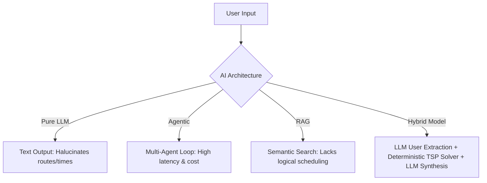

# Deep Research Report: AI Travel Assistant (TripGenius AI)

**Date:** June 4, 2026  
**Status:** Completed Step 1 (Research)  
**Output File:** `docs/research-AITravelAssistant.md`

---

## 1. User Research & Competitor Analysis

### Target Users
The platform targets three primary user personas:
1. **The Time-Starved Planner:** Busy professionals who want a high-quality, curated trip itinerary without spending hours reading blogs, cross-referencing maps, and verifying opening times.
2. **The Optimization Enthusiast:** Detail-oriented travelers who want to maximize their days, hitting all key attractions with the most efficient routes and timings.
3. **The Experiential Explorer:** Travelers looking for personalized recommendations tailored to highly niche interests (e.g., local architectural walking tours, vegan bakeries, kid-friendly art spaces) rather than generic TripAdvisor lists.

### User Pain Points
* **Choice Overload:** Too many options on platforms like Yelp, Google Maps, and TripAdvisor lead to decision paralysis.
* **Logistic Friction:** Cross-checking opening hours, transit durations, geographical proximity, and budgets manually using maps and spreadsheets is tedious and error-prone.
* **Static Itineraries:** Traditional travel agencies provide rigid packages, while blog posts provide single-perspective narratives that don't adapt to real-time preferences or weather.
* **AI Hallucinations:** First-generation AI chatbots routinely recommend closed restaurants, non-existent hotels, or physically impossible travel schedules.

### Competitor Analysis
* **Mindtrip:** Visual-first AI planning tool. Excels in visual discovery, dynamic map rendering, and group itinerary collaboration. Highly conversational but has a heavy interface.
* **Layla AI:** A consumer-facing booking-centric travel companion. Focuses heavily on the "chat to checkout" funnel, integrating direct bookings. Gated features and high operational cost.
* **Stippl:** A comprehensive planning platform that integrates budget management, packing lists, expense tracking, and group sharing. Strong on traditional logistics, weaker on deep AI personalization.
* **Wanderlog:** The industry standard for manual mapping and trip planning. Very strong UI for drag-and-drop logistics, but lacks automated, intelligent agent-driven schedules.
* **Kayak Ask AI / Expedia AI:** Incumbent search tools adding conversational wrappers. Excellent for live flight/hotel pricing, but poor at generating comprehensive, localized, multi-activity day schedules.

---

## 2. MVP Scope

To build a production-ready, highly focused MVP, the product scope is defined as follows:

| Feature Area | Must-Have Features (V1) | Future Features (V2 - Post-MVP) | Features to Avoid Initially |
|---|---|---|---|
| **AI Experience** | - Natural language preference extraction<br>- Conversational tuning of schedule | - Multi-city route planning<br>- Contextual weather-adaptive scheduling | - Voice interface chat<br>- Dynamic AI re-routing in real-time |
| **Itinerary** | - Hourly-optimized daily schedules<br>- Drag-and-drop manual editing<br>- Auto-calculated transit times | - Multi-transport optimization (transit/car/walk)<br>- Offline itinerary access | - Automated flight scheduling |
| **Hotels** | - Filtered hotel card recommendations<br>- Distance from key attractions metric | - Real-time booking verification<br>- Affiliate booking link generation | - Direct payment processing<br>- Multi-room reservation engine |
| **Map & UI** | - Dynamic map with markers<br>- Route visualizer linking activities | - Uber/Lyft deep-linking for routes<br>- Collaborative shared editing | - AR street views |

---

## 3. AI Architecture Research

Travel planning is fundamentally a multi-variable optimization problem combined with natural language understanding. We compared four AI patterns:



### Architectural Comparison

1. **Simple LLM Chatbot**
   * *Mechanism:* Sends the user prompt to an LLM, asking for an itinerary.
   * *Evaluation:* **Ineffective.** It cannot reliably calculate travel times between places, respects opening hours less than 50% of the time, and hallucinates closing times or geographic locations.

2. **AI Agent Workflow (e.g., LangGraph / CrewAI)**
   * *Mechanism:* Uses specialized agents (e.g., "Hotel Searcher", "Route Planner") executing tools in loops.
   * *Evaluation:* **Powerful but Slow.** It provides great conversational nuance, but running multiple agent iterations results in 20–40 second user wait times and high LLM token costs.

3. **RAG-based System (Retrieval-Augmented Generation)**
   * *Mechanism:* User preferences are vectorized; semantic search queries a local database of POIs and feeds top results to the LLM context.
   * *Evaluation:* **Good for discovery, poor for planning.** It ensures the POIs are real, but the LLM still struggles to logically sequence them into a daily schedule.

4. **Hybrid AI + Deterministic Algorithms (Recommended)**
   * *Mechanism:*
     * **Step 1:** LLM acts as the parser. It extracts dates, budget, interests, and style from the chat and turns them into a structured JSON query.
     * **Step 2:** Retrieval system fetches candidate attractions/hotels using spatial queries and vector search.
     * **Step 3:** A traditional operations research algorithm (Traveling Salesperson Problem with Time Windows - TSPTW) schedules the candidates, ensuring opening hours, travel distances, and durations are mathematically optimized.
     * **Step 4:** LLM acts as the copywriter. It reviews the optimized schedule and outputs engaging, contextual narratives.
   * *Evaluation:* **Highly Recommended.** It guarantees zero schedule hallucinations, respects exact time windows, and runs in sub-second times with minimal token consumption.

---

## 4. Travel Data Sources & APIs

Building a robust system requires combining multiple data providers. We evaluated the leading options:

### Data Provider Comparison

| Provider | Data Domain | Data Quality | Cost Structure | API Limitations / Friction | Developer Experience (DX) |
|---|---|---|---|---|---|
| **Google Places** | Attractions, Restaurants, Hotels | **Industry-Best.** Most accurate coordinates, reviews, opening hours, photos. | Pay-as-you-go. E.g., Details SKU is $17/1,000 requests. Subscription tiers available in 2026. | Strict caching limits (must not cache longer than 30 days). | Excellent. Broad SDK support. |
| **TripAdvisor** | Reviews, Ratings, POI details | **High quality** for B2C reviews. | Free Content API, but requires B2C traffic approval. | Hard B2B/development restriction. 1,000/day call cap for evaluation. | Moderate. Strict display terms. |
| **Amadeus Self-Service** | Hotels availability, pricing, flights | **High-quality commercial data.** | Pay-as-you-go with generous free monthly credits (2k - 10k requests). | Sandbox uses cached/stale data. Production registration is instant. | Excellent. Modern REST API with official libraries. |
| **OpenStreetMap (OSM)** | Geometries, POI coordinates, routing | **High quantity**, variable quality. | Free. | No ratings, reviews, or pricing. | Needs hosting a custom Overpass/OSRM server to avoid public rate-limits. |
| **Booking / Expedia** | Hotels, pricing, reviews | **High quality** transaction data. | Performance commission-based (free access if traffic yields stays). | Restricted to verified affiliate partners. B2B contracts required. | High friction for new startups. |

### Recommended MVP API Strategy
* **POI Search & Details:** Google Places API (Essential for ratings and coordinates).
* **Hotel Listings & Pricing:** Amadeus Self-Service API (Allows instant access to real-time hotel prices and listings without commercial contract delays).
* **Geographical Proximity & Routing:** Haversine formulas for immediate local planning; public OSRM (Open Source Routing Machine) or Google Distance Matrix API for true routing estimates.

---

## 5. Recommendation System Design

Personalized recommendation requires a multi-stage funnel:

```
[All Candidates (DB/API)] ➔ [1. Collaborative/Semantic Filter] ➔ [2. Rule/Constraint Solver] ➔ [3. LLM Final Reranker]
```

### Scoring and Ranking Methodology

#### Hotel Ranking
$$Score_{Hotel} = w_1 \cdot \text{Rating} - w_2 \cdot |\text{Price} - \text{TargetPrice}| - w_3 \cdot \text{DistanceToPOI} + w_4 \cdot \text{VectorSimilarity}$$

* **Factors:** Budget proximity, spatial distance to the center of planned daily activities, traveler reviews, and user preferences (e.g., luxury boutique vs. budget hostel).
* **Compare Ranking Techniques:**
  * *Vector Similarity Search:* Best for matching qualitative styles ("historic charm", "modern minimalist").
  * *Rule-Based Scoring:* Best for strict quantitative filters (price range, minimum rating > 4.0).
  * *LLM Ranking:* Too expensive to run on hundreds of hotels; reserved for selecting between the final top 5 recommendations.

#### Attraction Ranking
* **Factors:** User interest matches (based on semantic vector distance), attraction popularity/reviews, geographical clustering (to minimize day-to-day transit), and available time slots.
* **Compare Ranking Techniques:**
  * **Vector Search + Rule Scoring (Recommended):** Use Vector Search (pgvector) to find attractions matching the traveler's semantic interest profile, then score them based on distance from the hotel and popularity. Pass the filtered set to the scheduling solver.

---

## 6. Technical Requirements (Analytical Assessment)

To support the hybrid AI + TSP model, we define the following platform requirements:

* **Frontend Requirements:**
  * Client-side routing with high-performance map rendering (Mapbox GL or Google Maps JS SDK).
  * Smooth drag-and-drop state management (e.g., `@hello-pangea/dnd`) for manual itinerary reordering.
  * Real-time stream parsing for displaying conversational AI outputs chunk-by-chunk.
* **Backend Requirements:**
  * Highly-scalable serverless runtime (Edge/Serverless functions) to minimize cold starts.
  * Dedicated long-running processing worker for scheduling algorithms if switching to Python (FastAPI/Celery) under high loads.
  * Fast JSON serialization to shuttle data between the database, APIs, and the client.
* **Database Needs:**
  * PostgreSQL database supporting relational joins (essential for User -> Trips -> Days -> Items structure).
  * Vector extension (`pgvector`) for storing and querying 1536-dimensional user interest and attraction embeddings.
  * Geospatial queries (PostGIS or basic spatial index queries) to filter POIs by radius.
* **AI Needs:**
  * Model access to high-reasoning LLMs (e.g., Anthropic Claude 3.5 Sonnet or Gemini 1.5 Pro) for initial user parsing, and faster, cheaper models (Gemini 1.5 Flash / GPT-4o-mini) for itinerary synthesis.
  * Structured output support (JSON mode/Function Calling) to ensure data contract consistency.
* **Scaling Needs:**
  * Distributed caching layers (Redis/Upstash) to cache Google Places API details and generated schedules.
  * Queue mechanisms (RabbitMQ / BullMQ) to decouple user request handling from heavy mathematical scheduling solvers.

---

## 7. Risks & Mitigations

### 1. AI Hallucination & Outdated Places
* *Risk:* AI schedules a museum that is permanently closed, or suggests a hotel that doesn't exist.
* *Mitigation:* **Grounding & Validation.** The LLM is prohibited from self-generating place names. The LLM can only select from a validated list of place IDs returned by the Google Places or Amadeus APIs. Any manually entered text is run through a Place validation search.

### 2. Escalating API Costs
* *Risk:* A single trip plan can require 30–50 Place Details queries, costing over $0.50 per planning session.
* *Mitigation:* **Tiered Caching & Geohash Clustering.**
  1. Store place details in the local database. If a user queries details for a place we already have cached within its TTL (e.g., 14 days), serve it locally.
  2. Implement a local autocomplete cache.
  3. Restrict API requests to specific field masks (e.g., request only coordinates, rating, and opening hours; avoid requesting premium fields unless explicitly opened by the user).

### 3. Response Latency
* *Risk:* Fetching APIs, ranking results, running optimization solvers, and generating narrative copy can take 15–20 seconds, causing user abandonment.
* *Mitigation:* **Asynchronous Streaming UI.**
  * Step 1: Immediately return a placeholder "Trip Outline" skeleton.
  * Step 2: Stream the conversational LLM response in real-time.
  * Step 3: Populate the map with coordinates in the background as the solver finishes, creating an active, engaging loading experience.

### 4. Data Freshness
* *Risk:* Hotel availability and pricing changes minute-by-minute.
* *Mitigation:* **Separate Static vs. Dynamic State.** Never cache hotel availability or room pricing. Always treat hotel rates as volatile session data fetched live on-demand via the Amadeus API when a user views a specific hotel detail card. Cache attraction coordinates and general metadata long-term.

---
